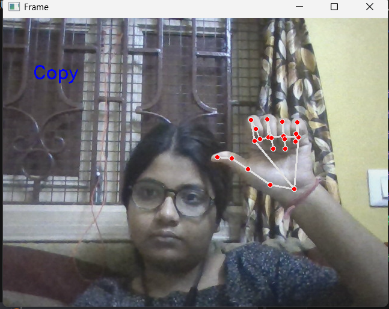
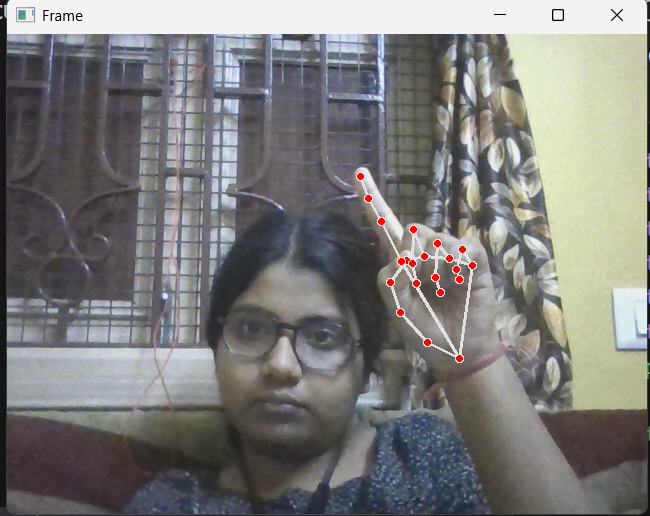

# Cursor Movement using Hand Gesture

## Overview

This project enables intuitive control of your computer's mouse cursor using hand gestures captured via a webcam. By leveraging computer vision techniques, the system detects hand landmarks and translates specific gestures into cursor movements and click actions. This offers an alternative, hands-free interaction method for various applications.

## Features

* **Real-time Hand Tracking:** Utilizes MediaPipe for robust and accurate hand landmark detection.
* **Gesture Recognition:** Identifies specific hand poses to control cursor movement and clicks.
* **Virtual Cursor Control:** Move the mouse pointer simply by moving your hand.
* **Virtual Clicks:** Perform left-clicks , right-click, double-click, with a designated hand gesture (e.g., two fingers ,closed thumb and index finger).
* **Adjustable Sensitivity:** Customize cursor movement speed and gesture detection thresholds.
* **Cross-platform (potentially):** Written in Python, making it adaptable to different operating systems.

## How it Works

The core of the project involves:
1.  **Webcam Input:** Captures live video feed from your webcam.
2.  **Hand Detection and Landmark Extraction:** The MediaPipe Hands model processes each video frame to detect hands and extract 21 3D hand landmark coordinates for each detected hand.
3.  **Gesture Interpretation:**
    * **Cursor Movement:** The coordinates of a specific finger (e.g., the tip of the index finger) are used to map to the screen's coordinates, thereby controlling the cursor's position.
    * **Click Detection:** The relative positions of multiple finger landmarks (e.g., the distance between the thumb tip and index finger tip) are monitored to detect a "pinch" or "click" gesture.
4.  **PyAutoGUI Integration:** The `pyautogui` library is used to programmatically move the system cursor and perform clicks based on the interpreted gestures.

Here's an example of hand landmark detection in action:




## Installation

### Prerequisites

* Python 3.x
* Webcam

### Steps

1.  **Clone the repository:**
    ```bash
    git clone [https://github.com/your-username/cursor-movement-hand-gesture.git](https://github.com/your-username/cursor-movement-hand-gesture.git)
    cd cursor-movement-hand-gesture
    ```
2.  **Create a virtual environment (recommended):**
    ```bash
    python -m venv venv
    source venv/bin/activate  # On Windows: `venv\Scripts\activate`
    ```
3.  **Install the required libraries:**
    ```bash
    pip install mediapipe opencv-python pyautogui
    ```

## Usage

1.  **Run the script:**
    ```bash
    python main.py  # Or whatever your main script is called
    ```
2.  **Webcam Feed:** A window will pop up displaying your webcam feed with hand landmarks overlaid.
3.  **Control:**
    * Move your hand to move the cursor.
    * Perform a specific gesture (e.g., pinching your thumb and index finger) to perform a left-click.
    * (Add more specific gesture descriptions if your project has them, e.g., "Raise your middle finger to right-click").
4.  **Exit:** Press `q` (or `Esc`) to quit the application.


